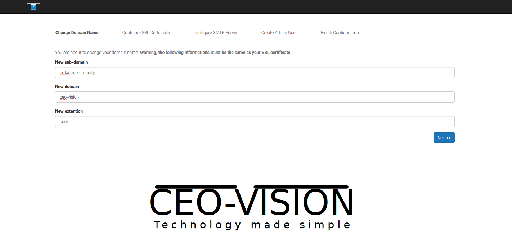
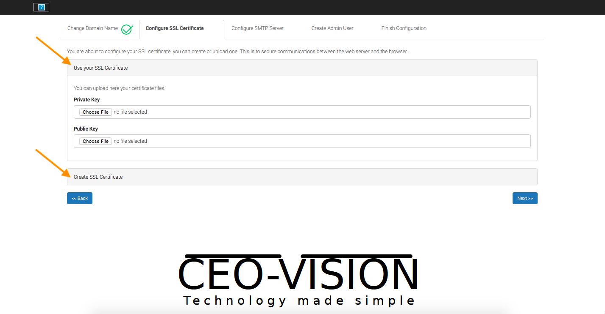
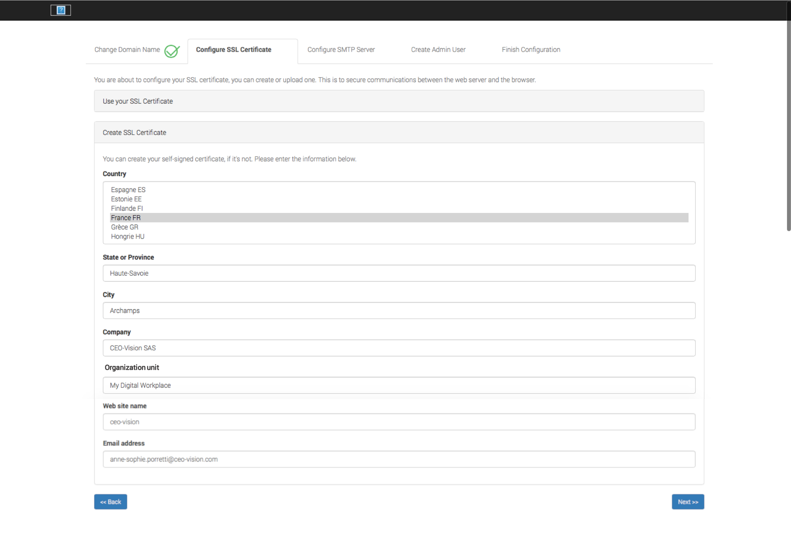
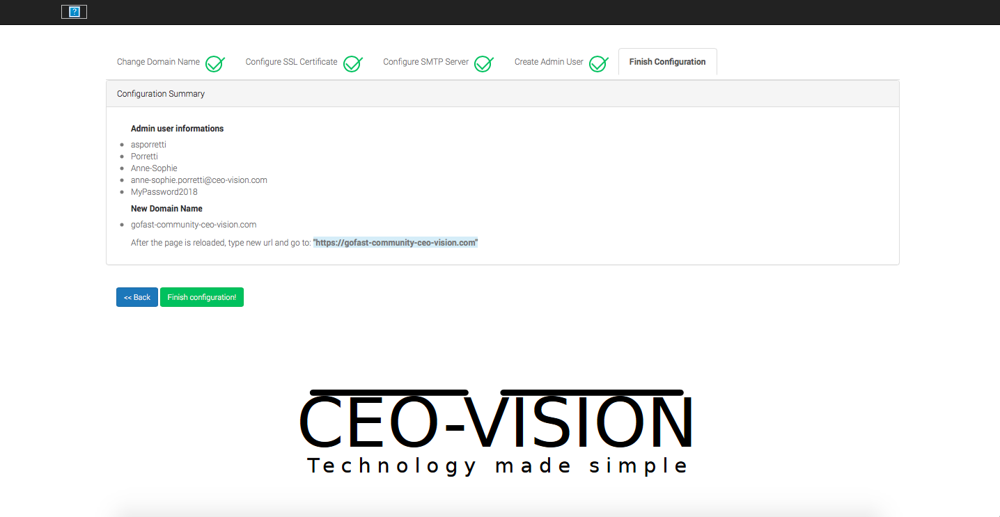

********************************************
GoFAST Community :  Installation
********************************************

.. note:: GoFAST Community will be soon available on AWS Marketplace

.. note:: If you have problems, you can ask some help on our Community forums:  https://community.ceo-vision.com

Instructions (from image)
------------

–Step 1: Download the image https://www.ceo-vision.com/en/content/gofast-community-ged-plateforme-collaborative-opensource (.ova, ...)

–Step 2: Start the instance on your VirtualMachine (VMWare, HyperV, ...)

–Step 3: Login to your instance with the following informations: 

``login : root`` ``password : @C0mmunity!`` (with a 0 not O) 

.. WARNING :: 
   Change immediately your root password 

–Step 4: Configure the IP address in for example  ``/etc/sysconfig/network-scripts/ifcfg-enp0s3`` 
and enter IPADDR  =  Choosen address instead of “192.168.8.212”

–Step 5: Define the FQDN ex. ``gofast-community.mydomain.com`` corresponding to your IP in your hosts file or DNS

–Step 6: Enter ``https://gofast-community.mydomain.com`` and configure the platform

Configuration
-------------

.. figure:: img/Logo-Community.png
   :alt: 

For all informations about pre-requisites please check this page (French for now) : https://gofast-docs.readthedocs.io/fr/latest/docs-gofast-technical/gofast-docs-prerequis-installation-serveur.html#gofast-pre-requis-et-installation-serveur

.. note:: To configure your GoFAST Community instance, please enter the IP address of the GoFAST server. 
          Example : http://35.180.66.5

5 steps are required to finish the GoFAST Community configuration : 

* Change name domaine
* Configure SSL Certificate
* Configure SMTP Server
* Create Admin User
* Finish Configuration 

You will find below detailed configuration for every steps and what is the purpose of every fields requiered.

Step 1 : Define Domain Name
-------------------

Configuration screen looks like: 

On this screen you will describe every part of the FQDN of GoFAST, ex. ``gofast.ceo-vision.com`` : 

   1. **New Sub-Domain** : This is the subdomain of the GoFAST, ex. ``gofast``
   2. **New Domain** : This is usualy the domain of your organisation ex. ``ceo-vision`` 
   3. **New extension** : This is the TLD, the last part of the url ex. ``com`` 

Etape 2 : Configure SSL Certificate 
-----------------------------------

At this step you will have 2 configuraiton possibilities.

The first option (recommended) is to upload your own SSL certificates 
  - **Key Private** :
  - **Key Public** :

The second option gives you the ability to create a self signed certificate. 
Several mandatory fields will be requested :

   
      
   1. **Country**
   2. **State or Province**
   3. **City**
   4. **Company** 
   5. **Organization unit** 
   6. **Web site name**
   7. **E-mail address** 

Step 3 : Configure SMTP Server 
-------------------------------

This third step will help you to configure the SMTP server used by GoFAST: 

.. figure:: img/gf-community-smtp-config.png
   :alt:
 
   
The different fields requested : 

   1. **SMTP Server** :  
   2. **Username** : 
   3. **Password** : 
   4. **Security** : None (without security), TLS (....), SSL (....)
   5. **SMTP Port** : 
   6. **Recipient address** : 

Step 4 : Create Admin User
---------------------------

This step will define the 'administrator' account who will have access to several configurations once the GoFAST instance is started

You will have to choose a login, password and email address linked to this 'admin' account 

.. figure:: img/gf-community-create-admin-user.png
   :alt:
   

Step 5 : Finish Configuration 
------------------------------

This last step is a summary of all informations entered in the previous steps for your GoFAST Community

.. WARNING :: 
   After clicking on "Finish Configuration" you will not be able to come back to the previous steps, 
   please check every fields before submitting 

   

   
